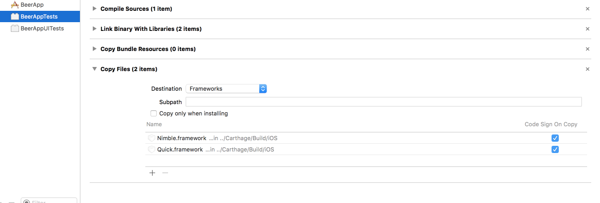

# TestTarget
Notes on configuring test targets

#### This applies to

- Main targets
  - App
  - Framework
- Test targets
  - Unit tests
  - UI tests

#### Examples

Dependencies used

- Main target: [Sugar](http://github.com/hyperoslo/Sugar)
- Test target: [Nimble](https://github.com/Quick/Nimble), [Quick](https://github.com/Quick/Quick)

Examples

- Cocoapods
- Carthage

#### Notes

- Make sure test target can link to all the frameworks it needs. This includes frameworks that Test targets use, and possibly frameworks that Main target uses !
- Remember to "Clean Build Folder" and "Clear Derived Data" so that you're sure it works. Sometimes Xcode caches.

### Errors

Errors occur mostly due to linker error

- Test target X encountered an error (Early unexpected exit, operation never finished bootstrapping - no restart will be attempted
- Framework not found

## Cocoapods

#### 1. Pod

Test targets need to include pods that Main target uses !

or we'll get "Framework not found"

```ruby
def app_pods
	pod 'Sugar', '~> 1.0'
end

def test_pods
	pod 'Nimble', '~> 3.2'
	pod 'Quick', '~> 0.9'
end

target 'TeaApp' do
	app_pods
end

target 'TeaAppTests' do
	app_pods
	test_pods
end

target 'TeaAppUITests' do
	app_pods
	test_pods
end

```

#### 2. Link Binaries with Library

Cocoapods builds a framework that contains all the frameworks the Test targets need, and configure it for us


#### 3. Runpath Search Paths

- Go to Test target Build Settings
- Add `$(FRAMEWORK_SEARCH_PATHS)`


## Carthage

#### 1. Cartfile

We usually have

- Cartfile for Main target

```swift
github "hyperoslo/Sugar" ~> 1.0
```

- Cartfile.private for Test target

```swift
github "Quick/Nimble"
github "Quick/Quick"
```

#### 2. Link Binaries with Libraries

- Go to Test target build phase
- Drag built frameworks from `Carthage/Build`
- In rare case, we need to drag frameworks that the Main target uses
- In rare case, we need to drag the Main target framework


#### 3. Framework Search Paths

Configure correct path

- Go to Test target Built Settings
- Configure Framework Search Paths


#### 4. Runpath Search Paths

- Go to Test target Build Settings
- Add `$(FRAMEWORK_SEARCH_PATHS)`


#### 5. Copy Files (maybe)

From [Adding frameworks to unit tests or a framework](https://github.com/Carthage/Carthage/blob/0.11/README.md#adding-frameworks-to-unit-tests-or-a-framework)

> In rare cases, you may want to also copy each dependency into the build product (e.g., to embed dependencies within the outer framework, or make sure dependencies are present in a test bundle). To do this, create a new “Copy Files” build phase with the “Frameworks” destination, then add the framework reference there as well.



## Runpath Search Paths and Install name

Question

- Why preconfigured run path "@executable_path/Frameworks" and "@loader_path/Frameworks" not work?
- Why configuring runpath to "$(FRAMEWORK_SEARCH_PATHS)" works ?
- Why framework has install name "@rpath/Sugar.framework/Sugar" ?

Reference

- [Run-Path Dependent Libraries](https://developer.apple.com/library/mac/documentation/DeveloperTools/Conceptual/DynamicLibraries/100-Articles/RunpathDependentLibraries.html)
- [Linking and Install Names](https://www.mikeash.com/pyblog/friday-qa-2009-11-06-linking-and-install-names.html)

## Author

Khoa Pham, onmyway133@gmail.com

## License

**GithubSwift** is available under the MIT license. See the [LICENSE](https://github.com/onmyway133/GithubSwift/blob/master/LICENSE.md) file for more info.
